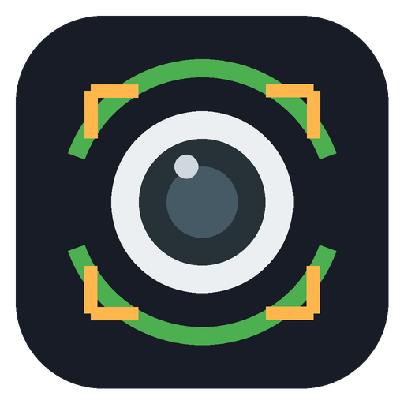

<p align="center"></p>

<h1 align="center">PTZ Pilot</h1>

<p align="center">Control a USB pan/tilt/zoom webcam on Windows and let it follow you around the room.</p>

PTZ Pilot started as a way to steer a Yealink MB Cam12X Pro without the vendor software. It grew into a small app that moves the camera, keeps your face in frame, parks the camera when nobody needs it, and passes the picture on to OBS.

## Install

1. Open the [releases page](https://github.com/realCmdData/ptz-pilot/releases) and download `PTZ-Pilot.exe` from the latest release.
2. Put the file wherever you like and double-click it. There is no installer and you don't need Python.

The exe isn't code-signed, so Windows SmartScreen may show a warning the first time. Click "More info" and then "Run anyway".

Plug in the camera before you start the app. On startup the camera moves to its center position (pan 0, tilt 0, zoom 0).

## What it can do

- Move the camera with buttons or the keyboard, click the picture to aim at a spot, and scroll to zoom.
- Save camera positions and jump back to them with the number keys.
- Follow you. Pick a wide, medium or close shot, or "Face only" for a tight close-up. Zoom can adjust itself automatically.
- Park the camera (pan 90, tilt -90, zoom 0) after a while when no app is using it. The picture switches off while it's parked, and the camera comes back as soon as something needs it.
- Send the picture to OBS Virtual Camera, with or without the tracking boxes, or open it as a browser link.
- Sit in the hidden icons area of the taskbar. Closing the window can hide the app there instead of
  quitting it, and it can start hidden. Right-click the icon for Follow me and Quit.
- Start with Windows, minimized.

## Keyboard shortcuts

| Action | Default key |
|---|---|
| Turn left / right | Left / Right |
| Tilt up / down | Up / Down |
| Zoom in / out | Plus / Minus |
| Follow me on/off | T |
| Go to the center position | Home |
| Go to a saved position | 1 to 9 |

Hold a movement or zoom key for as long as you want the camera to move. You can change the movement, zoom and Follow me keys in the Keys tab.

The Keys tab also has an option to make these shortcuts work while another app is in front. While that's on, the other app won't receive those keys, so use combinations such as Ctrl+Alt+Left instead of plain arrow keys.

## Using the camera in OBS, Teams or Zoom

Windows lets only one app use a camera's picture at a time. If you want PTZ Pilot to follow you while another app shows the picture:

1. In PTZ Pilot, open the Share tab and turn on "Send the picture to OBS Virtual Camera".
2. In the other app, choose "OBS Virtual Camera" as the camera.

OBS needs to be installed for this, and its own "Start Virtual Camera" button should stay off. Moving the camera works even while another app has the picture.

## Supported cameras

Any webcam that offers pan, tilt or zoom through the standard UVC camera controls should work. PTZ Pilot was built and tested with the Yealink MB Cam12X Pro, and it includes a few fixes for that camera: it never tilts above 0 even though it reports a higher limit, and its pan direction is reversed for continuous movement.

PTZ Pilot is not affiliated with Yealink.

## How following works

The app looks for faces with YuNet about once a second and follows the chosen face in between with OpenCV's VitTrack tracker, which keeps the CPU use low. The face position is smoothed before the camera moves. In "Face only" mode a Kalman filter also predicts where the face is heading, so the camera can keep up with steady movement and bridge short moments where the face isn't found. The first time you turn on following, the camera moves briefly to find out which way it turns.

Everything runs on your PC. The app doesn't connect to the internet, and the browser links only work on the same computer.

## Building from source

You need Windows 10 or 11 and 64-bit Python 3.10.

```powershell
powershell -ExecutionPolicy Bypass -File build.ps1
```

The script installs the dependencies and builds `dist\PTZ-Pilot.exe` with PyInstaller. To run the app without building, use `python app.py`.

Settings are saved in `%APPDATA%\PTZ Pilot\settings.json`.

## Versions

The version is shown in the window title and in the bottom right corner of the app. What changed in
each release is listed in [CHANGELOG.md](CHANGELOG.md).

## License

PTZ Pilot is released under the [GNU General Public License v3.0](LICENSE). The face detection and tracking models and the Python packages it uses are listed in [THIRD_PARTY_NOTICES.md](THIRD_PARTY_NOTICES.md).
